# Credit Risk Analysis

## Overview of the analysis

The goal of the loan prediction risk analysis was to build and evaluate several machine learning models or algorithms to predict credit risk. Once algorithms are implemented, need to evaluate their performance and see how well these models predict data. In this analysis imbalanced-learn and scikit-learn libraries were used to build and evaluate models using resampling.

## Results

Class imbalance refers to a situation in which the existing classes in a dataset aren't equally represented. On the below screenshot we can see that this applies to our dataset - good loans easily outnumber risky loans. And when using `train_test_split()` function from scikit-learn libraries we get the same imbalanced dataset:

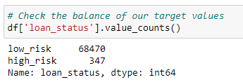

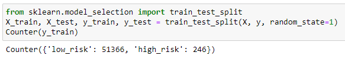

There are several strategies to deal with dataset; below are the results of 6 different models.

* Random Oversampling.

    Training data with Random Oversampling gives us balanced dataset:

    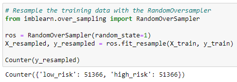

    - Balanced accuracy score is not that high, only 65%:

        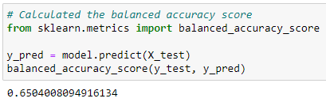

    - Precision (pre) is very high but for low-risk loans while for loans with high risk it is only 1%. Recall (rec), or sensitivity, is almost on the same level for both categories, but still not that high - 62% for high-risk and 68% for low-risk:

        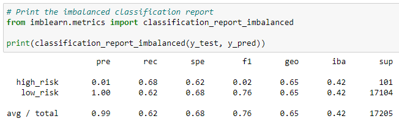

* SMOTE Oversampling.

    Training data with SMOTE Oversampling gives us balanced dataset:

    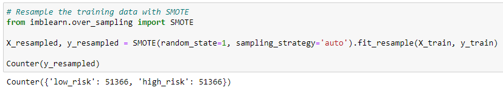

    - Balanced accuracy score is still not high - 65.8%:

        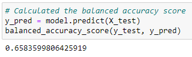

    - Precision (pre) and recall (rec) are on the same level as with Random Oversampling:

        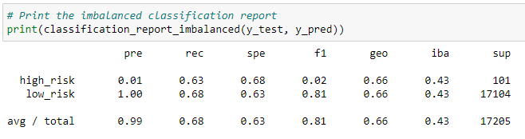

* Cluster Centroids Undersampling.

    Training data with ClusterCentroids gives us balanced dataset:

    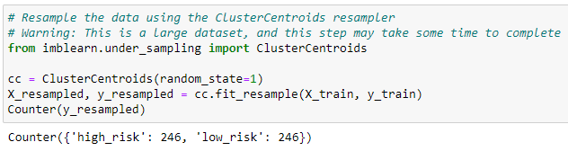

    - Balanced accuracy score is even lower than with previous methods, 54.4%:

        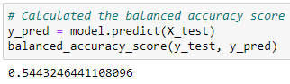

    - Precision (pre) is on the same level as with previous models. Recall (rec) is higher for high-risk loans - 69%, for low-risk it is 40%:

        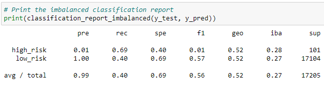

* SMOTEENN - a combination over- and under-sampling algorithm.

    Training data with SMOTEENN gives us balanced dataset:

    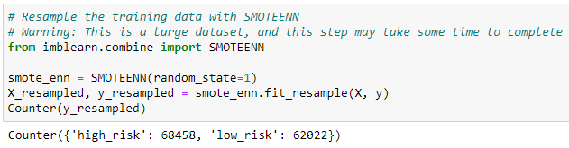

    - Balanced accuracy score has risen to 67.7%:

        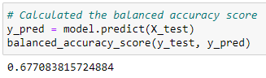

    - Precision (pre) is on the same level as with previous models. Recall (rec) has increased for high-risk loans to 76%, for low-risk it is 59%:

        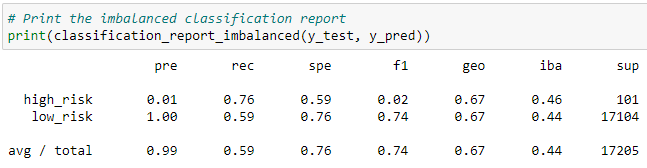

* Ensemble Learners - Balanced Random Forest Classifier.

    Training data with BalancedRandomForestClassifier gives us below dataset:

    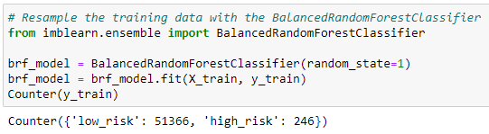

    - As of now balanced accuracy score is the highest one - 78.9%:

        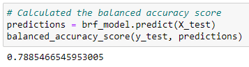

    - Precision (pre) is very high but for low-risk loans while for loans with high-risk it is only 3%. Recall (rec), or sensitivity, is 70% for high-risk and 87% for low-risk:

        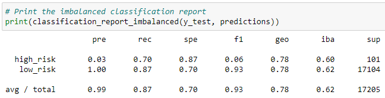

* Easy Ensemble AdaBoost Classifier.

    Training data with EasyEnsembleClassifier gives us below dataset:

    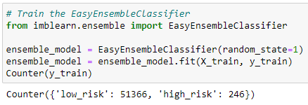

    - Balanced accuracy score is the highest one - 91.5%:

        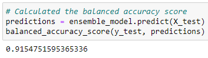

    - Precision (pre) and recall (rec), or sensitivity, have the highest percentage here for high-risk loans - 5% and 93% accordingly:

        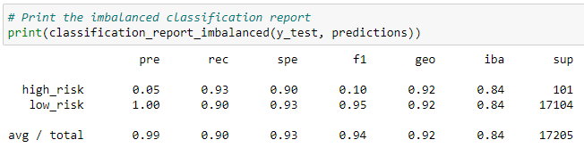

## Summary

Easy Ensemble AdaBoost Classifier has the highest accuracy score - 91.5%. However, it is not always an appropriate or a meaningful performance metric. For our analysis let's have a look on precision and sensitivity.

Precision is a measure of how reliable a positive classification is. Sensitivity is a measure of how many loans that actually high-risk were correctly flagged by our model. Easy Ensemble AdaBoost Classifier shows precision of 5% and recall of 93%.

For better understanding let's have a look on a below confusion matrix:

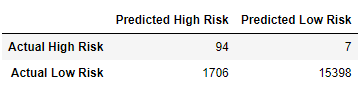

Our model predicted total of 1800 loans with high-risk (94 + 1706). Precision means that only 5% of those loans are actually high-risk (1800 * 5.22% = 94). Sensitivity means that those 94 actually high-risk loans are 93% of all actual high-risk loans. So, our model didn't catch only 7% of actual high-risk loans. This is a really good result and we can use this model for loan prediction.